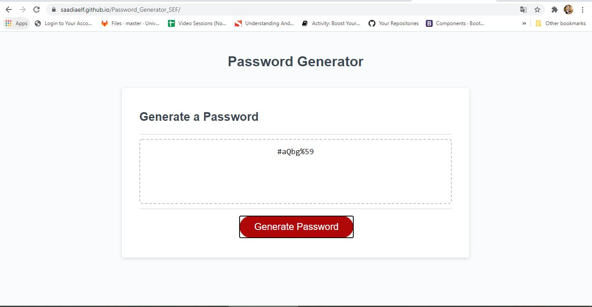

# -Password_Generator_SEF

-----------------------------------------------------------------------------------------------------------------------
Table of content :

1. The purpose
2. The method
3. HTML file
4. CSS file
5. JavaScript file
6. Screenshots
7. URLs 

-----------------------------------------------------------------------------------------------------------------------

## 1. The purpose :

The main purpose of this project is to create an application that an employee can use to generate a random password based on criteria they’ve selected by modifying starter code.

-----------------------------------------------------------------------------------------------------------------------

## 2. The method : 

    This website is created using the following languages and software.

    * HTML files : index.html.
    * CSS file : style.css
    * JavaScript file: script.js
    * VS Code
    * Github
   

-----------------------------------------------------------------------------------------------------------------------

## 3. HTML files : 
    
    This file is created according to the standards.

    * Using sementics
    * Using consistently indentation and spacing
    * Using links to link the HTML file to other files (CSS an JavaScript files)
    * Commenting the code

-----------------------------------------------------------------------------------------------------------------------

## 4. CSS file : 

This file is used to personalise the styles by creating new classes and id.

    The main CSS properties used in this website are :
    
    * Font : font-size, font-family, font-weight
    * Margin : margin-top, margin-left, margin-bottom, margin-right
    * Border : border-top, border-top-width, border-style
    * Position
    * Height
    * Width
    * Bottom
    * color : color, background-color

-----------------------------------------------------------------------------------------------------------------------

## 5. JavaScript file : 

This file is used to create a dynamic website using functions to generate random password.

    The main JavaScript properties and methods used in this website are :
    
    * Functions : creating new functions [inputLength(), generatePassword(), validateInput(), writePassword()]
    * DOM Window :  alert() Method, confirm() Method, prompt() Method
    * HTML DOM : addEventListener() Method , querySelector() Method, getElementById() Method
    * Conditions : if statements
    * Loops : do while loops

-----------------------------------------------------------------------------------------------------------------------

## 6. Screenshots :

    

-----------------------------------------------------------------------------------------------------------------------

## 7. URLs

* The URL of the deployed application : https://saadiaelf.github.io/Password_Generator_SEF/

* The URL of the GitHub repository: https://github.com/SaadiaELF/Password_Generator_SEF.git

-----------------------------------------------------------------------------------------------------------------------
